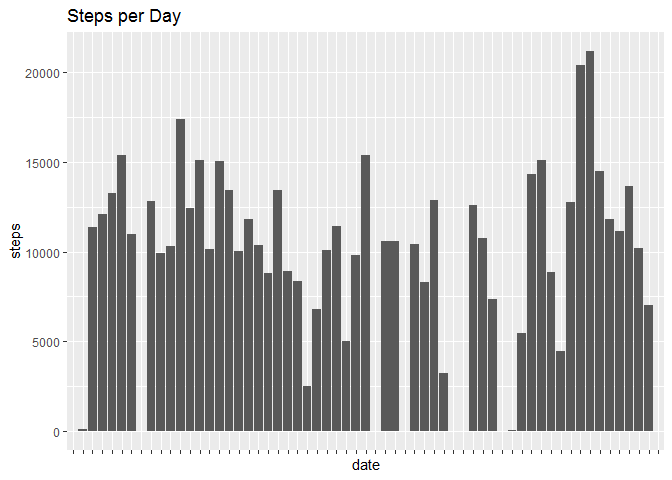
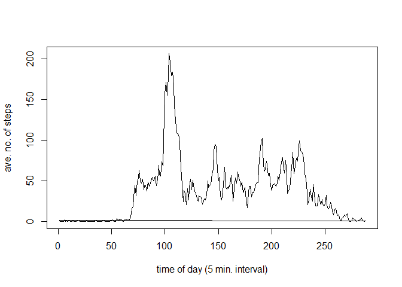
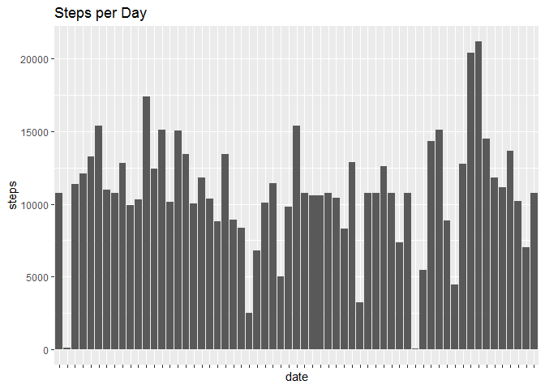
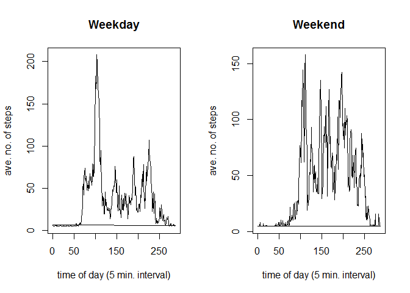

```r
knitr::opts_chunk$set(echo = TRUE)
```

## Loading and preprocessing the data

1. Code for reading in the dataset and/or processing the data


```r
## setwd("5. Reproducible Research/Quizzes/Project 1")
act <- read.csv("activity.csv")
```

## What is mean total number of steps taken per day?

2. Histogram of the total number of steps taken each day


```r
library(ggplot2)
ggplot(act, aes(date, steps)) + geom_col() + scale_x_discrete(labels=NULL) + labs(title="Steps per Day") 
```

```
## Warning: Removed 2304 rows containing missing values (position_stack).
```

<!-- -->

3. Mean and median number of steps taken each day


```r
act1 <- split(act, list(act$date))
act1 <- unlist(lapply(act1, function(x) sum(x[, "steps"])))
mean(act1, na.rm=TRUE)
```

```
## [1] 10766.19
```

```r
median(act1, na.rm=TRUE)
```

```
## [1] 10765
```

## What is the average daily activity pattern?

4. Time series plot of the average number of steps taken


```r
act[,"interval"]<-factor(act[,"interval"])
act2 <- split(act, list(act$interval))
act2 <- lapply(act2, function(x) mean(x[, "steps"], na.rm=TRUE))
plot(act$interval, act2[act$interval], type="l", xlab="time of day (5 min. interval)", ylab="ave. no. of steps")
```

<!-- -->

5. The 5-minute interval that, on average, contains the maximum number of steps


```r
act2a <- unlist(act2)
n <- which.max(act2a)
act2a[n]
```

```
##      835 
## 206.1698
```

## Imputing missing values

6. Code to describe and show a strategy for imputing missing data


```r
## Calculate number of missing values (na) in dataframe
sum(is.na(act))
```

```
## [1] 2304
```

```r
sum(is.na(act$steps))
```

```
## [1] 2304
```

```r
## Create new database to contain imputed values
act3 <- act
## Impute mean steps per interval to replace na values
namean <- function(x) replace(x, is.na(x), mean(x, na.rm = TRUE))
act3[] <- lapply(act3, namean)
```

```
## Warning in mean.default(x, na.rm = TRUE): argument is not numeric or logical:
## returning NA

## Warning in mean.default(x, na.rm = TRUE): argument is not numeric or logical:
## returning NA
```

7. Histogram of the total number of steps taken each day after missing values 
are imputed (plus mean, median, and time series plot of average steps per interval)


```r
## Histogram of total steps per day after missing values are imputed
ggplot(act3, aes(date, steps)) + geom_col() + scale_x_discrete(labels=NULL) + labs(title="Steps per Day")
```

<!-- -->

```r
## Mean and median steps per day after missing values are imputed
act3a <- split(act3, list(act3$date))
act3a <- unlist(lapply(act3a, function(x) sum(x[, "steps"])))
mean(act3a)
```

```
## [1] 10766.19
```

```r
median(act3a)
```

```
## [1] 10766.19
```

```r
## Time series plot of average steps per interval after missing values are imputed
act3[,"interval"]<-factor(act3[,"interval"])
act3b <- split(act3, list(act3$interval))
act3b <- lapply(act3b, function(x) mean(x[, "steps"]))
plot(act3$interval, act3b[act3$interval], type="l", xlab="time of day (5 min. interval)", ylab="ave. no. of steps")
```

<!-- -->

## Are there differences in activity patterns between weekdays and weekends?

8. Panel plot comparing the average number of steps taken per 5-minute interval 
across weekdays and weekends


```r
## Convert date column to class "Date"
library(chron)
```

```
## NOTE: The default cutoff when expanding a 2-digit year
## to a 4-digit year will change from 30 to 69 by Aug 2020
## (as for Date and POSIXct in base R.)
```

```r
act3$date <- as.Date(act3$date)
## Create weekday/weekend factor in dataframe
act3$weekend <- factor(ifelse(is.weekend(act3$date), "weekend", "weekday"))
## Prepare data for plotting - comparing weekday data to weekend data
act4a <- subset(act3, act3$weekend=="weekday")
act4aa <- split(act4a, list(act4a$interval))
act4aa <- lapply(act4aa, function(x) mean(x[, "steps"]))
act4b <- subset(act3, act3$weekend=="weekend")
act4bb <- split(act4b, list(act4b$interval))
act4bb <- lapply(act4bb, function(x) mean(x[, "steps"]))
## Plot weekday/weekend average steps data
par(mfrow=c(1,2))
plot(act4a$interval, act4aa[act4a$interval], type="l", xlab="time of day (5 min. interval)", ylab="ave. no. of steps", main = "Weekday")
plot(act4b$interval, act4bb[act4b$interval], type="l", xlab="time of day (5 min. interval)", ylab="ave. no. of steps", main = "Weekend")
```

<!-- -->

9. All of the R code needed to reproduce the results (numbers, plots, etc.) in the report is outlined above :)
